# vvedo 说明文档


[TOC]

## 1 我

181250020 软件学院 成浩鹏

## 2 取名灵感

从视频 “video” 出发，旨在让大家分享自己、欣赏别人的生活与欢乐，共享我们的所做所见所闻 “we do” 。两个短语并成 “vvedo” 。

## 3 项目文件结构

### 3.1 全部文件

 ```
.
├── app //安卓端代码
├── build.gradle
├── gradle
├── gradle.properties
├── gradlew
├── gradlew.bat
├── local.properties
├── server //服务端代码
├── settings.gradle
├── vvedo.apk //安卓端应用安装包
├── 说明文档.pdf
└── 说明文档 //说明文档源文件
 ```

### 3.2 安卓端代码文件

```
.
├── api //与后端交互相关
│   ├── ApiServiceImpl.java //接口实例
│   ├── ApiService.java //接口
│   └── SimpleResponse.java //接口返回类型
├── bean
│   └── VideoBean.java //视频对象
├── MainActivity.java //主活动
└── ui
    ├── component //共用的组件
    │   ├── VideoListAdapter.java //视频列表组件适配器
    │   ├── VideoList.java //视频列表组件
    │   └── VideoPlayerActivity.java //视频播放器活动
    ├── square //广场页面
    │   ├── SquareFragment.java
    │   └── SquareViewModel.java
    ├── upload //上传页面
    │   ├── UploadFragment.java
    │   └── UploadViewModel.java
    └── user //用户页面
        ├── UserFragment.java
        └── UserViewModel.java
```

### 3.3 服务端代码文件

```
.
├── config
│   └── OssConfig.java //视频上传配置
├── controller //控制层
│   ├── UserController.java
│   └── VideoController.java
├── entity //数据表实体
│   ├── User.java
│   └── Video.java
├── form //表单
│   ├── LoginForm.java
│   └── SimpleResponse.java
├── mapper //持久化层
│   ├── UserMapper.java
│   └── VideoMapper.java
├── ServerApplication.java //主程序
└── util //工具类
    ├── AliOssUtil.java
    └── Utils.java
```

## 4 项目特点、创新点

1. 实现了服务器端，有相应的数据库，并且把 OSS 作为视频库
2. 注册、登录后才能上传视频
3. 能查看自己上传的视频
4. 视频播放能够上下滑动切换视频
5. 能够给视频无限点赞，且会有小红心提示
6. 视频会经过压缩后上传，减小服务器负担
7. 一些组件使用了非线性动画

## 5 项目难点

- 视频列表及其适配器的编写和调试，以及布局
- 在配置文件中加了权限，但仍然无法获取录像、文件读写等权限
  - 在主活动中主动申请各种权限
- 视频文件上传到后端，花了很长时间尝试应该用哪一种请求的格式以及注解、应该如何把文件写入到请求
- 后端服务器接收到视频后，再上传到 OSS 后返回链接

## 6 功能演示

进入应用后首先进入广场页面，能看到所有人上传的视频。

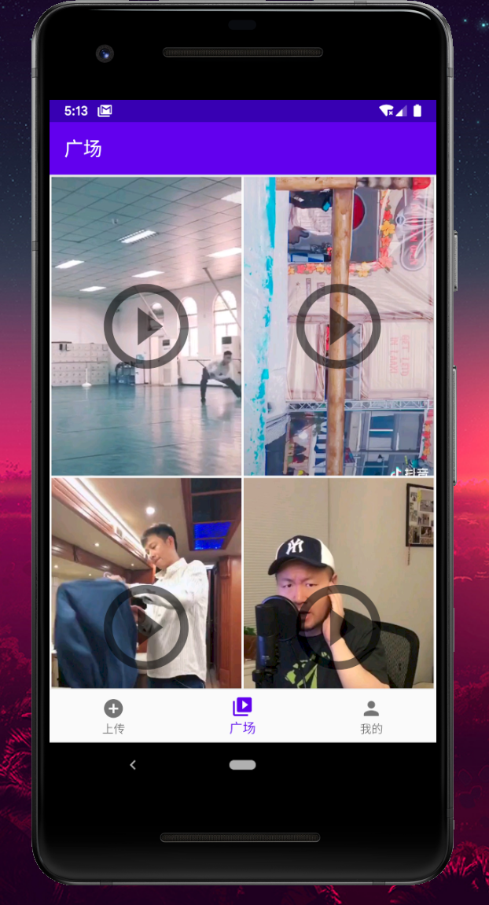

点开其中一个，上方是上传者的头像、昵称以及视频的简介，左下方是视频的获赞数。

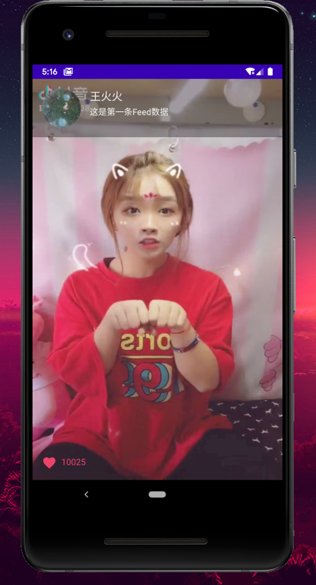

双击屏幕会在点击的位置有小红心跳出来，并且获赞数会重新向后端获取。

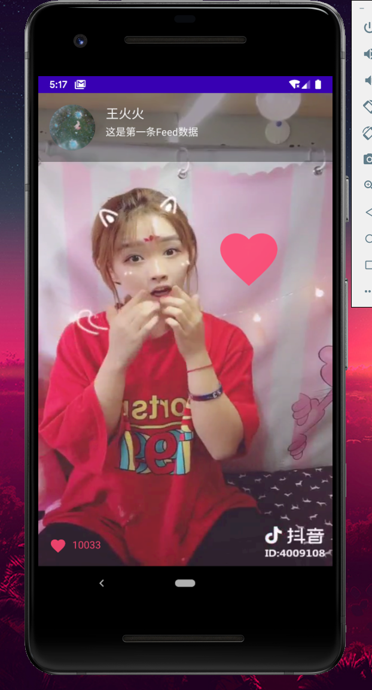

单击可以暂停，再次单击继续播放。

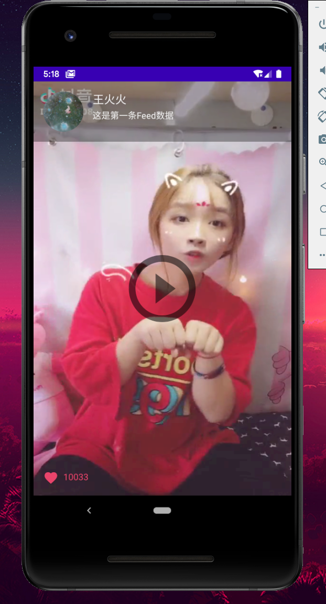

上下滑动屏幕可以切换视频。

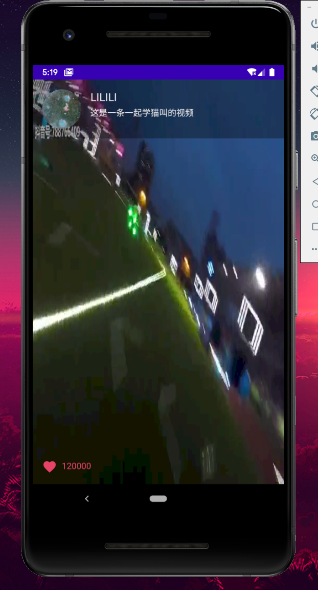

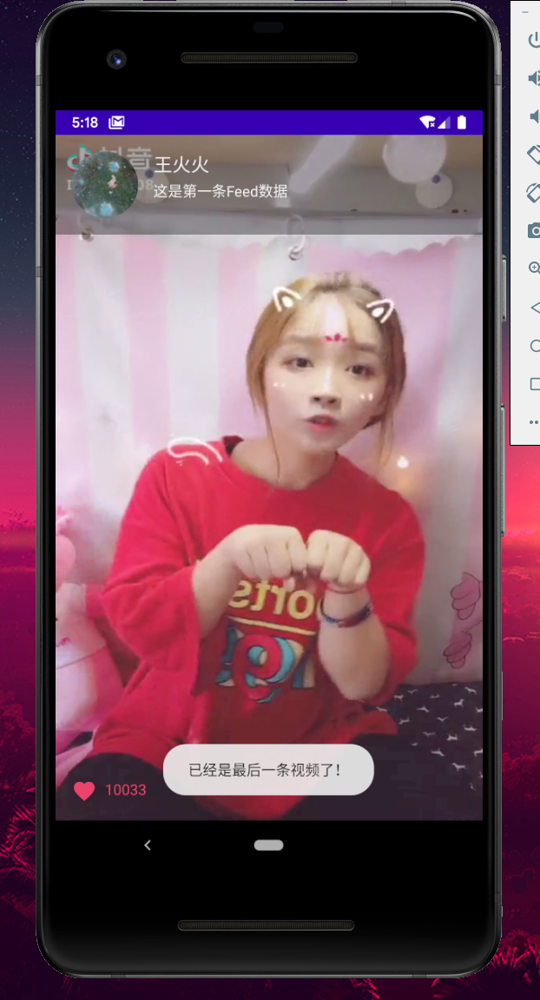

退出播放页，到用户页，输入用户名和密码可以登录，如果该用户名没有注册过则自动注册。

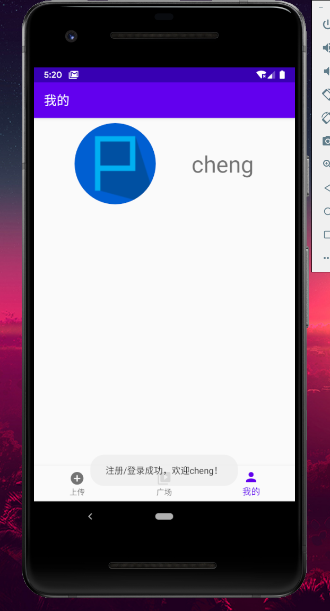

现在自己的视频列表是空的。到上传页面，点击录制，录制好一段视频，写好描述，点击上传，即可将录好的视频压缩并上传。

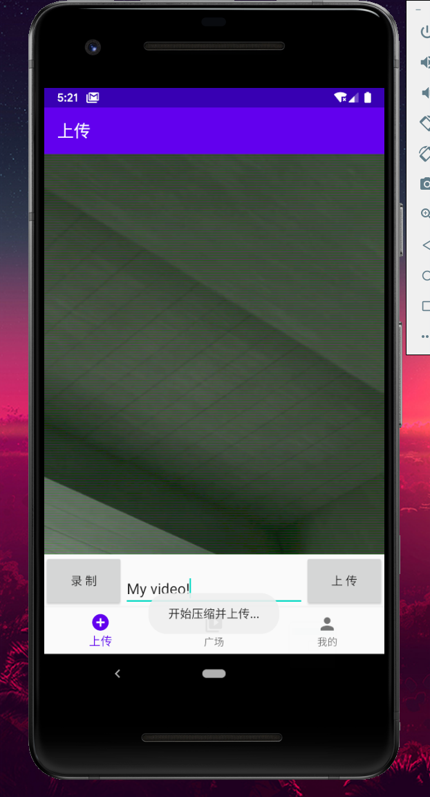

再次回到用户页，可以看到刚才录制的视频，点开就会跳转到播放页。

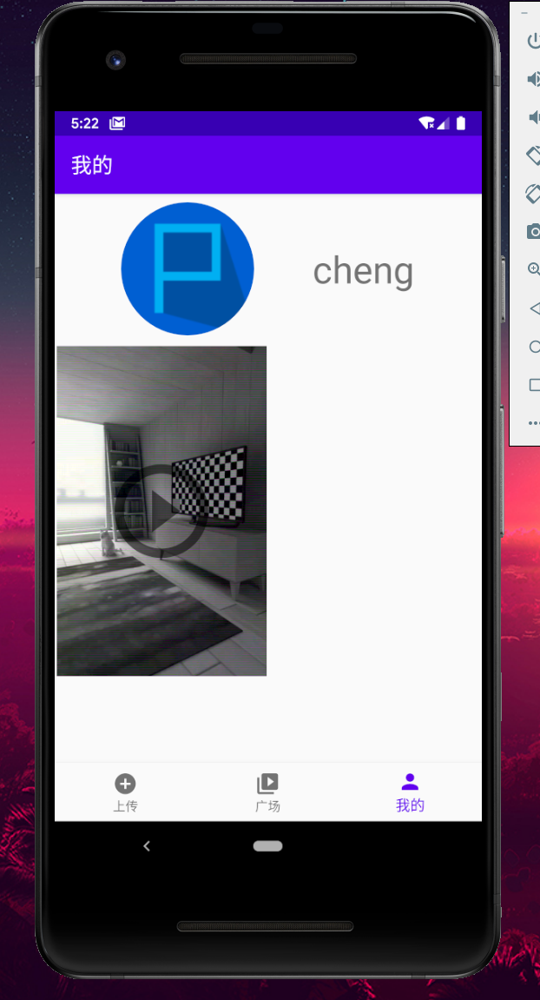

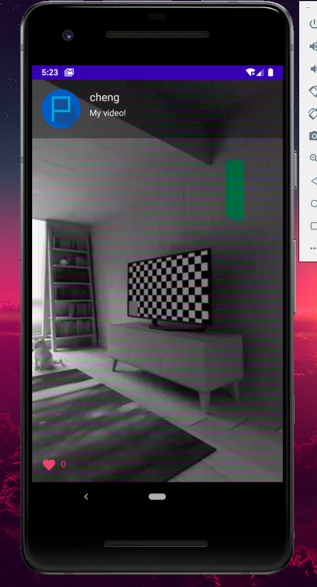

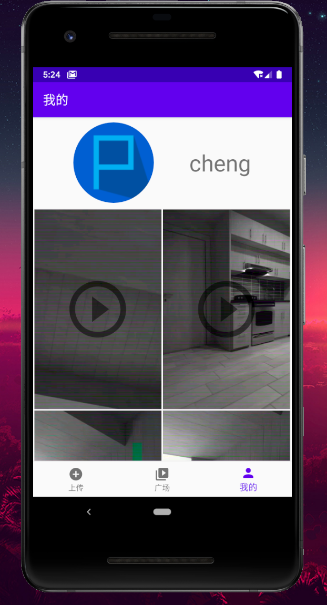

回到广场页，可以看到自己的视频出现在这里。

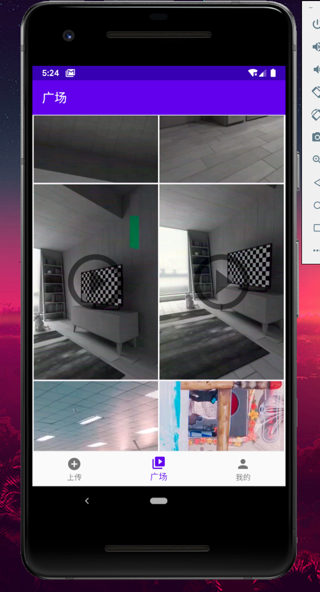